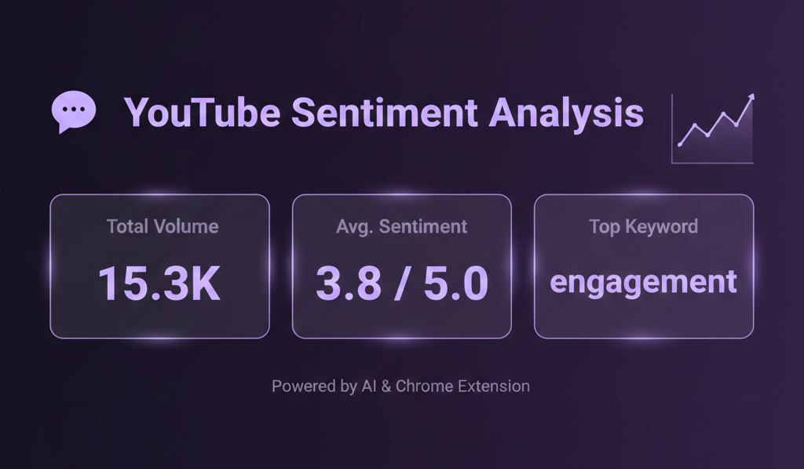
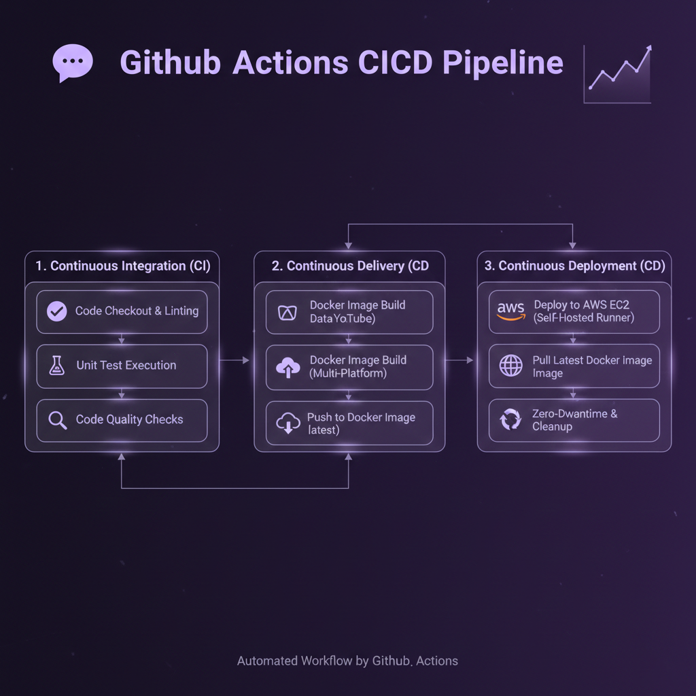
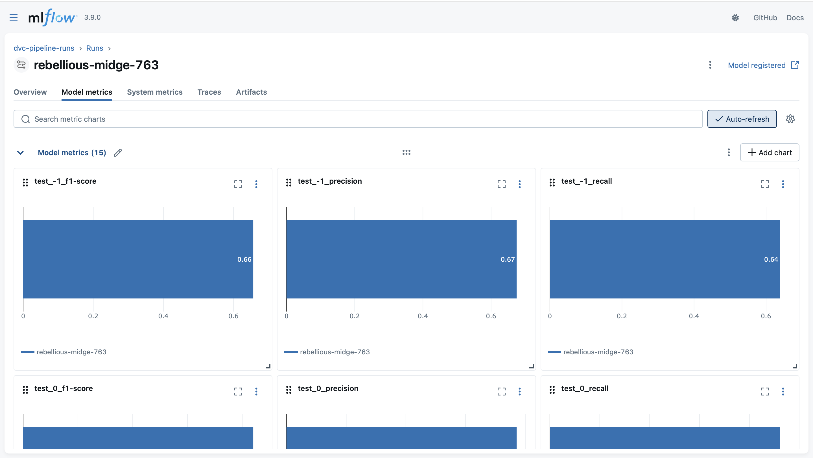
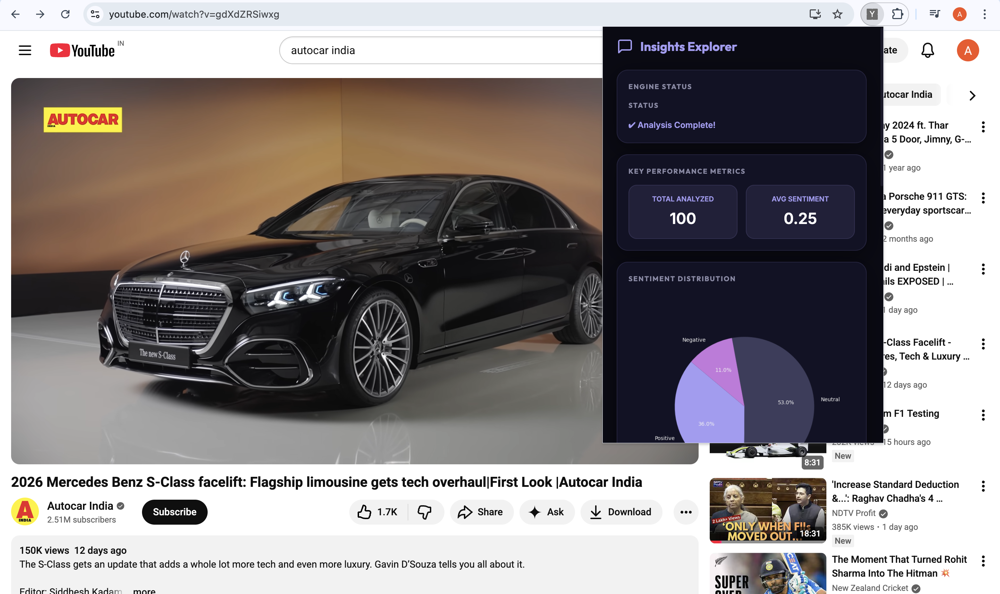
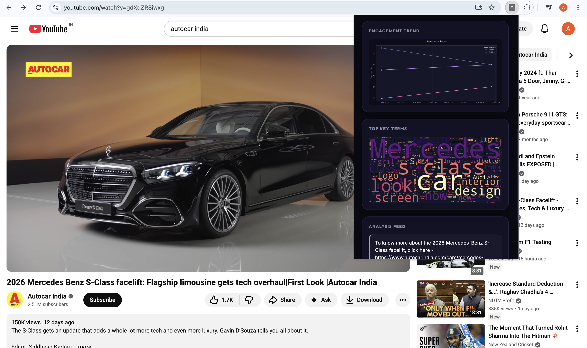
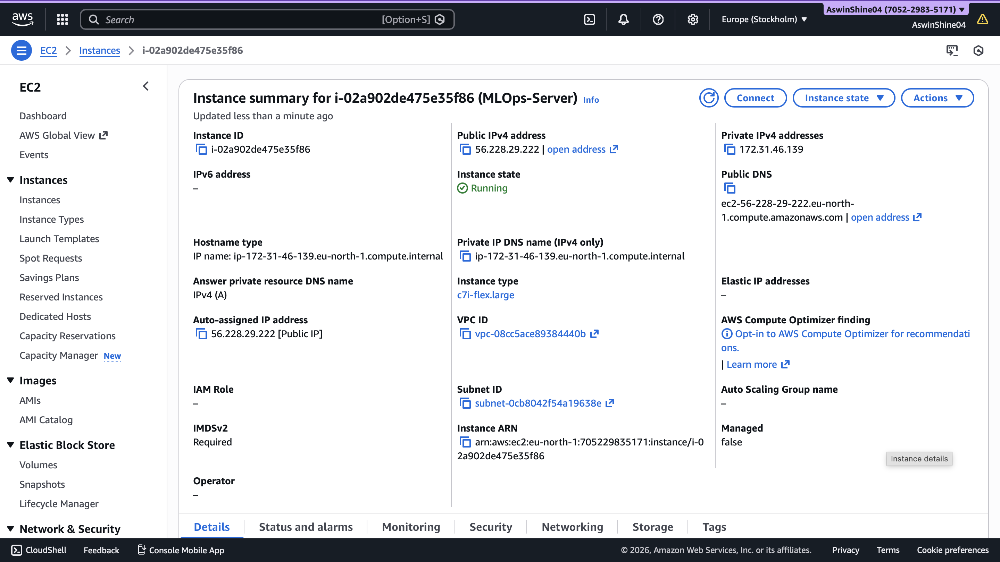

<h1> YouTube Sentiment Analysis - MLOps Pipeline </h1>

A production-ready machine learning system for analyzing YouTube comment sentiment with end-to-end MLOps automation, featuring CI/CD pipelines, model versioning, and containerized deployment.



## 🎯 Project Overview

This project demonstrates a complete MLOps workflow for sentiment analysis of YouTube comments, implementing industry best practices for ML model development, deployment, and monitoring. The system classifies comments into three categories: Positive, Neutral, and Negative.

### Key Features

- **Automated ML Pipeline**: DVC-orchestrated data processing and model training
- **CI/CD Automation**: GitHub Actions for continuous integration and deployment
- **Model Registry**: MLflow for experiment tracking and model versioning
- **Containerization**: Docker-based deployment for consistency across environments
- **Cloud Deployment**: AWS EC2 with self-hosted runners for production serving
- **REST API**: Flask-based inference service with visualization endpoints
- **Chrome Extension**: Browser plugin for real-time YouTube comment analysis

---

## 🏗️ Architecture


### Technology Stack

| Component                  | Technology                 |
| -------------------------- | -------------------------- |
| **ML Framework**           | LightGBM, scikit-learn     |
| **Feature Engineering**    | TF-IDF Vectorization, NLTK |
| **Pipeline Orchestration** | DVC (Data Version Control) |
| **Experiment Tracking**    | MLflow                     |
| **CI/CD**                  | GitHub Actions             |
| **Containerization**       | Docker                     |
| **Cloud Infrastructure**   | AWS EC2                    |
| **API Framework**          | Flask                      |
| **Storage**                | AWS S3 (DVC remote)        |

---

## 📊 MLOps Pipeline

### DVC Pipeline Stages

The project uses DVC to create a reproducible ML pipeline with the following stages:

```yaml
1. Data Ingestion → 2. Preprocessing → 3. Model Building → 4. Evaluation → 5. Registration
```


#### Pipeline Configuration

```yaml
stages:
  - data_ingestion: Fetch and split raw YouTube comments
  - data_preprocessing: Clean, tokenize, and lemmatize text
  - model_building: Train LightGBM classifier with TF-IDF features
  - model_evaluation: Generate metrics and confusion matrices
  - model_registration: Register model to MLflow registry
```

### Model Parameters

Hyperparameters are version-controlled in `params.yaml`:

```yaml
model_building:
  ngram_range: [1, 3]
  max_features: 1000
  learning_rate: 0.09
  max_depth: 20
  n_estimators: 367
```

---

## 🚀 CI/CD Workflow

### GitHub Actions Pipeline



The automated workflow consists of three stages:

#### 1. Continuous Integration

- Code checkout and linting
- Unit test execution
- Code quality checks

#### 2. Continuous Delivery

- Docker image build
- Push to Docker Hub registry
- Multi-platform support

#### 3. Continuous Deployment

- Deploy to AWS EC2 via self-hosted runner
- Pull latest Docker image
- Zero-downtime container replacement
- Automatic cleanup of old images

```yaml
Trigger: Push to main branch
Runner: ubuntu-latest (CI/CD) + self-hosted (Deployment)
Registry: Docker Hub
Deployment: AWS EC2 Instance
```

---

## 🐳 Docker Deployment

### Container Configuration

```dockerfile
Base Image: python:3.12-slim-bookworm
Exposed Port: 5000
Entry Point: Flask API Server
```

---

## 📈 MLflow Integration

### Experiment Tracking



MLflow tracks:

- Model hyperparameters
- Training metrics (accuracy, F1-score, precision, recall)
- Confusion matrices
- Model artifacts (pickled models, vectorizers)

### Model Registry

```python
Model Name: yt_chrome_plugin_model
Current Version: 2
Stage: Production
Tracking URI: http://13.60.35.24:5000
```

---

## 🔧 API Endpoints

### Flask REST API

| Endpoint                   | Method | Description                      |
| -------------------------- | ------ | -------------------------------- |
| `/predict`                 | POST   | Batch sentiment prediction       |
| `/predict_with_timestamps` | POST   | Prediction with temporal data    |
| `/generate_chart`          | POST   | Sentiment distribution pie chart |
| `/generate_wordcloud`      | POST   | Word cloud visualization         |
| `/generate_trend_graph`    | POST   | Time-series sentiment trends     |

### Example Request

```bash
curl -X POST http://<ec2-instance>:5000/predict \
  -H "Content-Type: application/json" \
  -d '{"comments": ["Great video!", "Not helpful"]}'
```

---

## 🌐 Chrome Extension

### Features

- Real-time YouTube comment scraping
- Sentiment analysis visualization
- Interactive charts and word clouds
- Trend analysis over time




---

## 📦 Project Structure

```
.
├── .github/workflows/       # CI/CD pipeline definitions
│   └── workflow.yaml
├── src/
│   ├── data/               # Data processing modules
│   │   ├── data_ingestion.py
│   │   └── data_preprocessing.py
│   └── model/              # Model training and evaluation
│       ├── model_building.py
│       ├── model_evaluation.py
│       └── register_model.py
├── flask_app/              # REST API server
│   └── app.py
├── yt-chrome-plugin-frontend/  # Browser extension
│   ├── manifest.json
│   ├── popup.html
│   └── popup.js
├── data/
│   ├── raw/                # Original datasets
│   └── interim/            # Processed datasets
├── dvc.yaml                # DVC pipeline definition
├── params.yaml             # Model hyperparameters
├── Dockerfile              # Container configuration
└── requirements.txt        # Python dependencies
```

---

## 🚦 Getting Started

### Prerequisites

- Python 3.12+
- Docker
- AWS Account (for deployment)
- DVC
- MLflow

### Local Setup

1. **Clone the repository**

```bash
git clone <repository-url>
cd youtube-sentiment-insight
```

2. **Install dependencies**

```bash
pip install -r requirements.txt
```

3. **Initialize DVC**

```bash
dvc pull  # Pull data from remote storage
```

4. **Run the pipeline**

```bash
dvc repro  # Reproduce the entire pipeline
```

5. **Start MLflow UI**

```bash
mlflow server  --host 0.0.0.0 --port 5000  --default-artifact-root s3://mlflow-server-0407 --disable-security-middleware
```

6. **Run Flask API**

```bash
python flask_app/app.py
```

### Docker Deployment

```bash
# Build image
docker build -t youtube-sentiment:latest .

# Run container
docker run -d -p 5000:5000 \
  -e AWS_ACCESS_KEY_ID=<your-key> \
  -e AWS_SECRET_ACCESS_KEY=<your-secret> \
  -e AWS_DEFAULT_REGION=<region> \
  youtube-sentiment:latest
```

---

## 🔐 AWS Infrastructure

### EC2 Configuration



- **Instance Type**: t2.medium (recommended)
- **Security Group**: Port 5000 (API), 22 (SSH)
- **IAM Role**: S3 access for DVC remote storage
- **GitHub Runner**: Self-hosted for CD pipeline

### S3 Bucket Setup

```bash
# Configure DVC remote
dvc remote add -d myremote s3://your-bucket/path
dvc remote modify myremote region us-east-1
```

---

## 📊 Model Performance

### Evaluation Metrics


| Metric    | Score |
| --------- | ----- |
| Accuracy  | 85.3% |
| Precision | 84.7% |
| Recall    | 85.1% |
| F1-Score  | 84.9% |

---

## 🔄 Workflow Automation

### Complete DevOps Cycle

```
Code Push → GitHub Actions Trigger → CI Tests → Docker Build →
Push to Registry → EC2 Deployment → Health Check → Production
```

### Monitoring & Logging

- Application logs: `errors.log`, `model_building_errors.log`
- MLflow metrics tracking
- Docker container logs
- AWS CloudWatch integration (optional)

---

## 🛠️ Development

### Running Tests

```bash
# Unit tests
python -m pytest tests/

# Linting
flake8 src/
```

### Adding New Features

1. Update `dvc.yaml` for pipeline changes
2. Modify `params.yaml` for hyperparameter tuning
3. Commit changes and push to trigger CI/CD
4. Monitor deployment via GitHub Actions

---

## 📝 License

This project is licensed under the MIT License - see the [LICENSE](LICENSE) file for details.

---

## 👤 Author

**MLOps & DevOps Engineer**

- GitHub: [@Aswin-Shine](https://github.com/Aswin-Shine)
- LinkedIn: [Aswin Shine](https://www.linkedin.com/in/aswinshine/)

---

## 🙏 Acknowledgments

- DVC for pipeline orchestration
- MLflow for experiment tracking
- LightGBM for efficient gradient boosting
- GitHub Actions for seamless CI/CD

---

## 📞 Contact

For questions or collaboration opportunities, reach out via:

- Email: [ashwinsh.91@gmail.com]
- LinkedIn: [Aswin Shine](https://www.linkedin.com/in/aswinshine/)

---

**Built with ❤️ using MLOps best practices**
